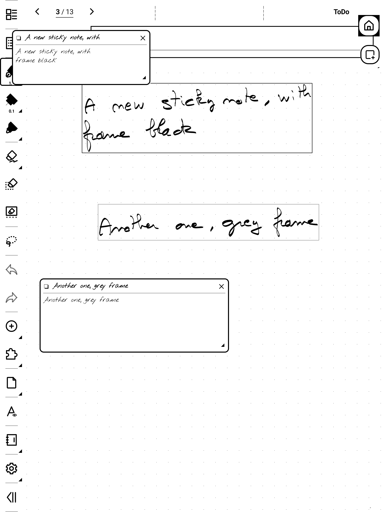

# SuperStickyNote

Floating sticky quick-notes for Supernote e-ink devices. A small **launcher bubble** floats
over everything; tap it and a **sticky note** appears on top of your notebook or document.
Write with the keyboard, drag it around, keep several open at once — your thoughts land
on the page without ever leaving what you were doing.

It works the other way too: **lasso your handwriting** or **select text in a PDF**, and it
becomes a sticky note that remembers where it came from.


## Features

- Floating sticky notes over the **NOTE** and **DOCUMENT** apps — **8 on screen** by
  default, up to **40** if you want them, overlapping freely
- **Single-tap** inline keyboard editing, auto-saved; **collapse**, **move**, **resize**,
  long notes scroll
- **Capture from the page**, three ways, each keeping a **Go to source** backlink:
  - **lasso handwriting** in a notebook — OCR straight into a sticky note
  - **lasso handwriting** on a **PDF/EPUB** annotation — same thing, in your reading
  - **select text in a PDF/EPUB** → **Add to StickyNote**, no recognition needed
- **Underline a word** inside the lasso and it becomes a **label** on the new note
- **Insert in note** — put a sticky note's text back on the notebook page as an editable
  text box, in your chosen font and size
- A Manager in the device's own visual language: **left rail of filters with counts**,
  always-on **search**, **paged** list, and a note's actions under the note itself
- **Text size** XS→XXL and **fonts** (Sans/Serif/Mono + your own from `MyStyle/fonts`,
  each **previewed in its own typeface**); show/hide the bubble; optional **frame** drawn
  around captured text
- **Export** to `.txt`, **backup/restore** to `.json` (import merges, never overwrites)
- Notes stored **privately** (not cloud-synced)

> Sticky notes hold plain text — handwriting *inside* a card isn't supported yet.

> **Which version do I need?** Supernote's firmware is called *Chauvet* — that's the
> platform name, so what matters is the version number (check it in device settings). This
> release targets **Chauvet 3.29.43 (Manta/Nomad) / 2.26.40 (A5 X / A6 X) or later** — the
> builds with the plugin permission system and the current plugin API. A build made for one
> firmware version doesn't run on the other: devices on an earlier Chauvet need the
> previous release. Installing the wrong one shows *"package not compatible"* or the plugin
> does nothing. Verified on Manta/Nomad.

## Screens

**The Manager** — filters with counts on the left, search above the list, and the selected
note's actions right under it.


**Settings** — every font shown in its own typeface, and the on-screen maximum is yours to set.


**Capture from a PDF** — select text, tap the plugin button in the selection toolbar.


**Or lasso handwriting on the PDF itself** — recognised and dropped into a sticky note.


**Lasso handwriting → sticky note (OCR), in a notebook**


**Frame the captured text on the note (black or grey) — each sticky keeps its backlink**



## Install

1. Copy `superstickynote-<version>.snplg` (see [Releases](../../releases/latest)) to `MyStyle/` on the device.
2. **Settings → Apps → Plugins → Add Plugin** → pick the file.
3. Open a notebook — the bubble appears.

## Documentation

See the **[User Guide](USER_GUIDE.md)** for the full walkthrough and gesture reference.

## Build

```bash
npm install
./buildPlugin.sh        # → build/outputs/SuperStickyNote.snplg
```
React Native 0.79.2 + `sn-plugin-lib`. The native overlay bridge is in
`android/app/src/main/java/com/superstickynote/`.

## Support

Free & made with love by a Supernote user, for Supernote users.
☕ **https://ko-fi.com/agp42**
