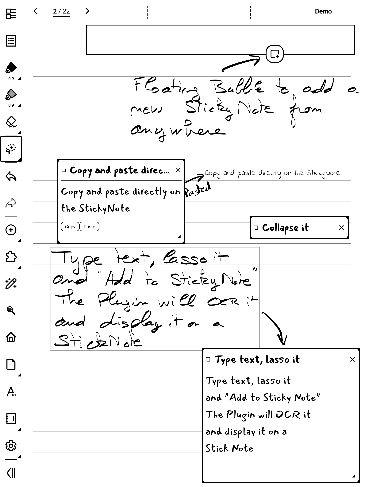
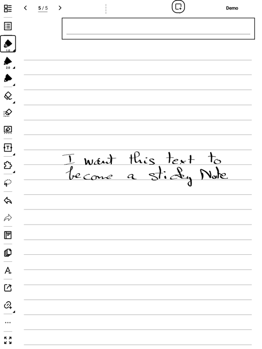
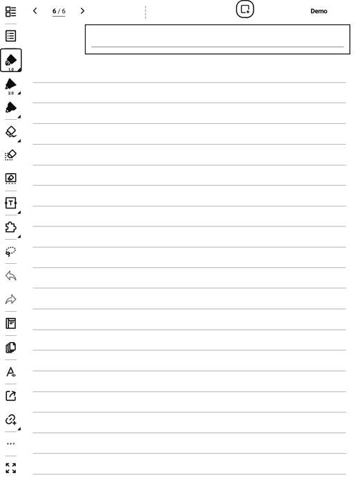

# SuperStickyNote

Floating sticky quick-notes for Supernote e-ink devices. A small **✚ bubble** floats
over everything; tap it and a **sticky note** appears on top of your notebook or document.
Write with the keyboard, drag it around, keep several open at once — your thoughts land
on the page without ever leaving what you were doing.



## Features

- Floating sticky notes over the **NOTE** and **DOCUMENT** apps — up to **8 on screen**, overlapping
- **Single-tap** inline keyboard editing, auto-saved; **collapse**, **move**, **resize**, long notes scroll
- **Labels** with a filter (and an "Untagged" filter); **search**
- **Lasso → Add to sticky**: OCR handwriting straight into a new sticky note
- Edit a note's **text, icon and labels** from the list, with **copy / paste**
- **Text size** XS→XXL and **fonts** (Sans/Serif/Mono + your own from `MyStyle/fonts`)
- Live preview: open sticky notes stay on top of the Manager, so font/size changes show in real time
- **Export** to `.txt`, **backup/restore** to `.json` (import merges, never overwrites)
- Notes stored **privately** (not cloud-synced)

> Text only for now — handwriting inside a sticky note isn't supported yet. Tested on Manta (A5 X2) and A5 X.

## Demos

**Lasso handwriting → sticky note (OCR)**



**Sticky note → note → export**



## Install

1. Copy `superstickynote-<version>.snplg` (see [Releases](../../releases/latest)) to `MyStyle/` on the device.
2. **Settings → Apps → Plugins → Add Plugin** → pick the file.
3. Open a notebook — the ✚ bubble appears.

## Documentation

See the **[User Guide](USER_GUIDE.md)** for the full walkthrough and gesture reference.

## Build

```bash
npm install
./buildPlugin.sh        # → build/outputs/SuperStickyNote.snplg
```
React Native 0.79.2 + `sn-plugin-lib`. The native overlay bridge is in
`android/app/src/main/java/com/superstickynote/`.

## Support

Free & made with love by a Supernote user, for Supernote users.
☕ **https://ko-fi.com/agp42**
