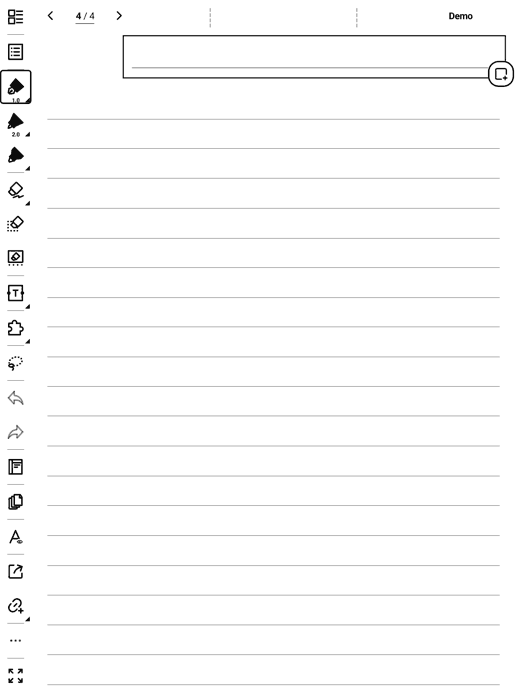

# SuperStickyNote

Floating sticky quick-notes for Supernote e-ink devices. A small **✚ bubble**
floats over everything; tap it and a **post-it** appears on top of your notebook
or document. Write with the keyboard, drag it around, keep several open at once —
your thoughts land on the page without ever leaving what you were doing.



## Features

- Floating post-its over the **NOTE** and **DOCUMENT** apps — up to **8 on screen**, overlapping
- **Inline keyboard editing**, auto-saved as you type
- **Collapse** to just the title, **move**, and **resize** each post-it
- **Long-press** to copy / paste
- A full page to browse & **search** all notes, with per-note **icons** (symbols + digits 0–9) and **text size** XS→XXL
- **Insert** a note into your notebook page, or **export** it as `.txt`
- **Backup / restore** everything to a `.json` file
- Notes kept in the plugin's **private** storage (not cloud-synced); exports go to a visible folder

> Text only for now — handwriting inside a post-it is not supported yet.
> Tested on Manta (A5 X2); uses the standard plugin runtime.

## Install

1. Copy `superstickynote-<version>.snplg` (see [Releases](../../releases)) to `MyStyle/` on the device.
2. **Settings → Apps → Plugins → Add Plugin** → pick the file.
3. Open a notebook — the ✚ bubble appears. Grant the overlay permission if asked.

## Documentation

See the **[User Guide](USER_GUIDE.md)** for the full walkthrough and gesture reference.

## Build

```bash
npm install
./buildPlugin.sh        # → build/outputs/SuperStickyNote.snplg
```
React Native 0.79.2 + `sn-plugin-lib`. The native overlay bridge lives in
`android/app/src/main/java/com/superstickynote/`.

## Support

Free & made with love by a Supernote user, for Supernote users.
☕ **https://ko-fi.com/agp42**
