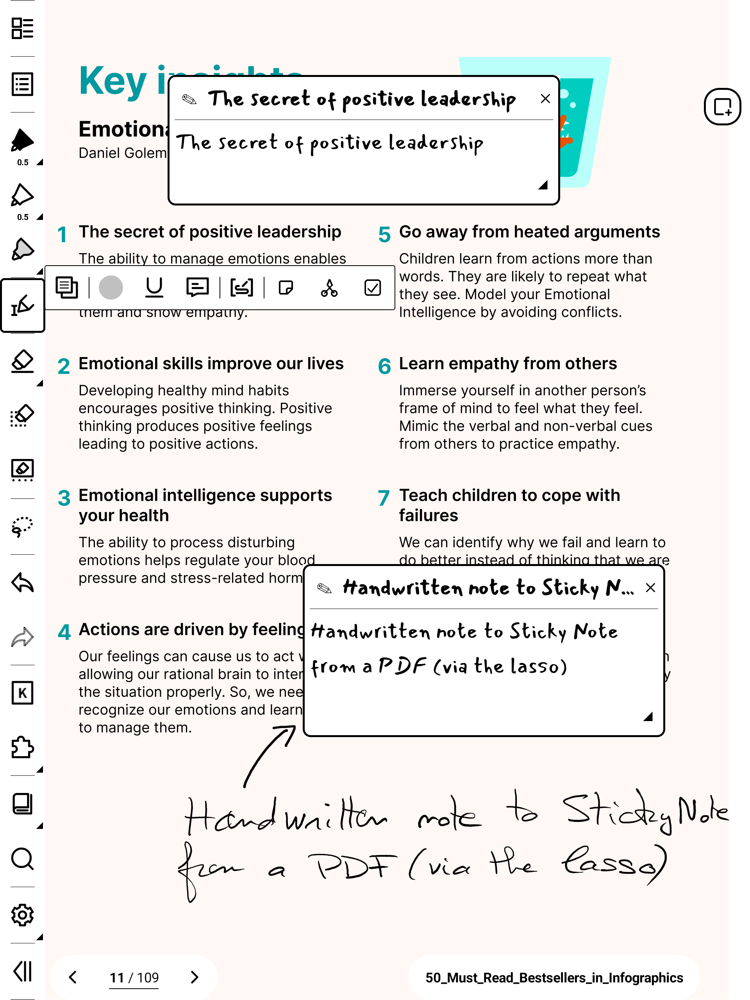
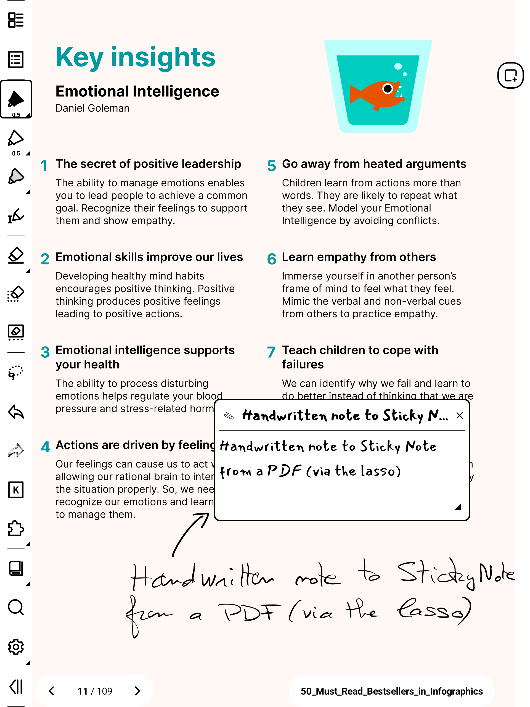
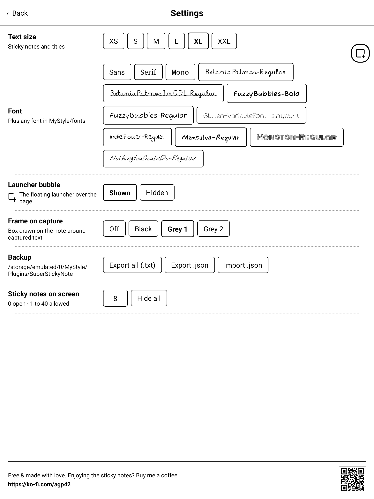

# SuperStickyNote

Floating sticky quick-notes for Supernote e-ink devices. Tap the bubble and a **sticky
note** appears on top of your notebook or document — type, drag it aside, keep several
open. Your thoughts land on the page without ever leaving what you were doing.

And it works the other way round: **lasso your handwriting** or **select text in a PDF**,
and it becomes a sticky note that remembers where it came from.


## What it does

- **Sticky notes that float** over the NOTE and DOCUMENT apps — type, collapse, move,
  resize. 8 on screen by default, up to 40 if you want them.
- **Capture handwriting** with the lasso: it's recognised and dropped into a new sticky
  note, in a notebook *or* on a PDF annotation.
- **Capture PDF text**: select it, tap the plugin button in the selection toolbar. No
  recognition needed.
- **Put text back on the page** as an editable text box, in the font and size you chose.
- **Find them again**: every captured note links back to its file and page; filter by
  label, search the lot.

## Capture from a PDF

Select text with the reader's text tool, then tap SuperStickyNote in the selection
toolbar that pops up.



Handwritten annotations on a PDF work too — lasso them exactly as you would in a notebook.



## Back to the page

A sticky note isn't a dead end: its text goes back onto the notebook page as a real,
editable text box.


## The Manager

Filters with counts on the left, search above the list, and the selected note's actions
right under it.


## Settings

Text size, the bubble, the capture frame, backups — and every font you've dropped in
`MyStyle/fonts`, each shown in its own typeface.



## Install

1. Copy `superstickynote-<version>.snplg` (see [Releases](../../releases/latest)) to `MyStyle/` on the device.
2. **Settings → Apps → Plugins → Add Plugin** → pick the file.
3. Open a notebook — the bubble appears.

> **Which version do I need?** Supernote's firmware is called *Chauvet* — that's the
> platform name, so what matters is the version number (check it in device settings). This
> release targets **Chauvet 3.29.43 (Manta/Nomad) / 2.26.40 (A5 X / A6 X) or later**. A
> build made for one firmware version doesn't run on the other: devices on an earlier
> Chauvet need the previous release. Installing the wrong one shows *"package not
> compatible"* or the plugin does nothing. Verified on Manta/Nomad.

## Documentation

Everything else — every gesture, the underline-to-label trick, exports and backups, and
the known limits — is in the **[User Guide](USER_GUIDE.md)**.

## Build

```bash
npm install
./buildPlugin.sh        # → build/outputs/SuperStickyNote.snplg
```
React Native 0.79.2 + `sn-plugin-lib`. The native overlay bridge is in
`android/app/src/main/java/com/superstickynote/`.

## Support

Free & made with love by a Supernote user, for Supernote users.
☕ **https://ko-fi.com/agp42**
