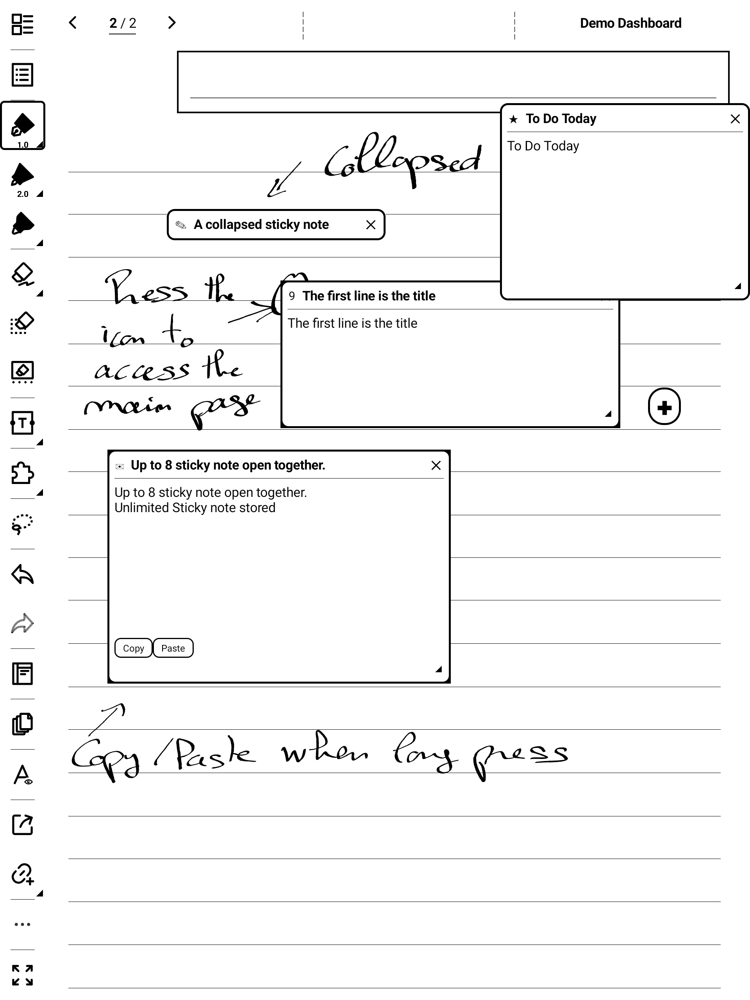
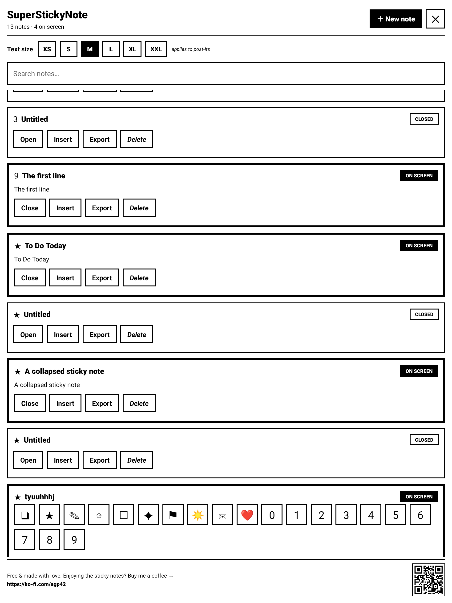
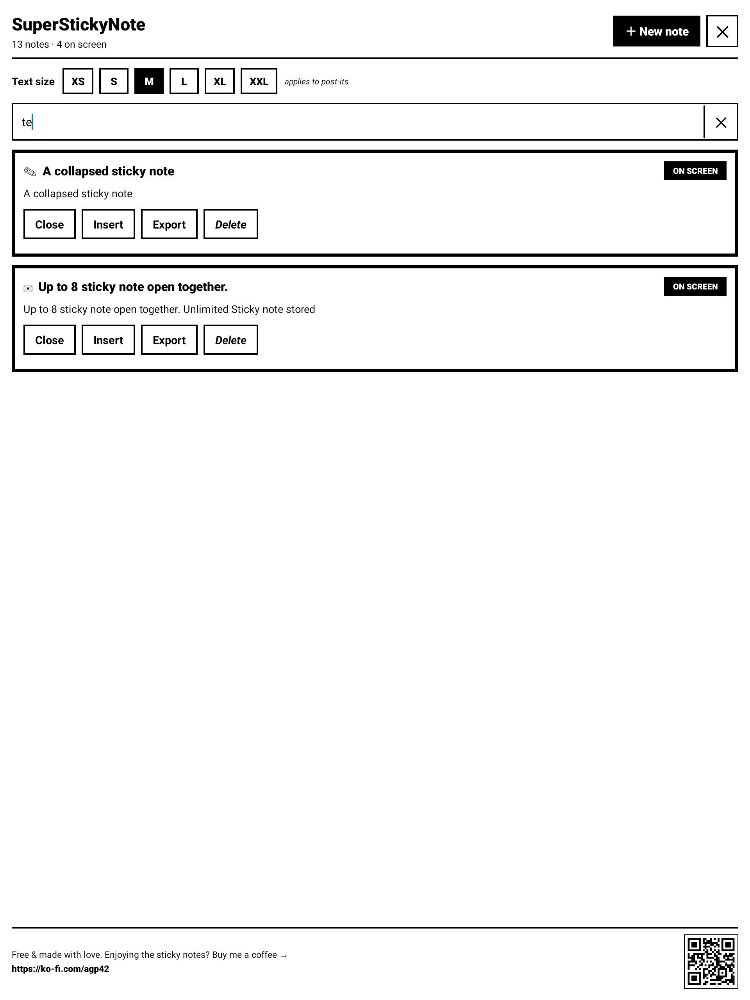

# SuperStickyNote for Supernote — User Guide

Floating sticky quick-notes for your Supernote. A small **✚ bubble** floats over
everything; tap it and a **post-it** appears on top of your notebook or document.
Write with the keyboard, drag it around, keep several open at once — your thoughts
land on the page without ever leaving what you were doing.

> Works inside the **NOTE** and **DOCUMENT** apps. Notes are plain text (handwriting
> is not supported yet). Tested on Manta (A5 X2); other current models use the same
> plugin runtime.


---

## 1. Install

1. Copy `superstickynote-<version>.snplg` to the `MyStyle/` folder on the device
   (via USB, or `adb push … /storage/emulated/0/MyStyle/`).
2. On the device: **Settings → Apps → Plugins → Add Plugin** → pick
   `superstickynote-<version>.snplg`.
3. Open a notebook. The **✚ bubble** appears (top-right by default).

**Overlay permission.** Post-its float using the system overlay permission. If they
don't appear, open the plugin from the toolbar and tap **Grant** on the banner, then
allow "Display over other apps" for the plugin host.

*Updating:* uninstall the old version first (Settings → Apps → Plugins), then add the
new `.snplg`.

---

## 2. The bubble

The **✚ bubble** (bottom-right in the screenshot above) is always within reach.

- **Tap ✚** → creates a new post-it and opens the keyboard right away.
- **Drag** the bubble to move it anywhere.

The bubble and your open post-its hide automatically while the full plugin page is
open, and come back when you leave it.

---

## 3. The post-it



A post-it floats on top of the page. The rest of the screen stays live — you can
keep writing in your notebook in the gaps between post-its.

| Gesture | What it does |
|---|---|
| **Tap the body** | Edit — the keyboard opens and you type inline |
| **✓ (top-right)** | Finish editing — closes the keyboard |
| **Tap the header bar** | Collapse / expand (collapsed shows only the first line as the title) |
| **Tap the icon** | Open the full list (Manager) |
| **Drag the header** | Move the post-it |
| **Drag the ◢ corner** | Resize (bottom-right) |
| **Long-press the body** | Copy / Paste bar |
| **✕ (top-right)** | Close the post-it (it stays saved in the list) |

**Saving is automatic** — text is saved as you type. Tapping outside the post-it
also closes the keyboard.

The first non-empty line becomes the **title** shown when the note is collapsed and
in the list.

You can have up to **8 post-its on screen at once**. They overlap freely. When you
reach 8, adding another shows a reminder instead of removing one — close a post-it
first to make room. There is **no limit** on how many notes you keep in total.

---

## 4. The full page (Manager)

Open it from the **toolbar button**, or by **tapping a post-it's icon**.



- **＋ New note** — pick an icon, then a fresh post-it floats on the page.
- **Search** — filter by text; tap the **✕** to clear.
- **Text size** — **XS · S · M · L · XL · XXL** applies to every post-it (title and
  body). Takes effect the next time a post-it is shown.
- **Per note**: tap the row's **icon** to change it (symbols and digits **0–9**).
- **Per note actions**:
  - **Open / Close** — show or hide the post-it on the page.
  - **Insert** — drops the note's text into the current notebook page as a text box
    (NOTE files only).
  - **Export** — saves the note as a `.txt` file (see below).
  - **Delete** — removes the note for good.

The **ON SCREEN / CLOSED** tag on each row tells you what's currently floating.



---

## 5. Where your notes live & backups

Your notes live in the plugin's **private, hidden** storage (not in a synced
folder), so cloud sync can't corrupt them. To back them up or move them to another
device, use the buttons at the bottom of the Manager — everything they write goes
to a **visible** folder you can reach over USB/MTP:

```
MyStyle/Plugins/SuperStickyNote/
├── <title>.txt                     one file per note (Export all)
└── SuperStickyNote-notes.json      full backup (Export .json)
```

- **Export all (.txt)** — writes every note as its own text file.
- **Export .json** — writes a single `SuperStickyNote-notes.json` snapshot of
  everything (text, icons, positions, sizes).
- **Import .json** — reads that same `SuperStickyNote-notes.json` back and
  **replaces** your notes with it. To restore on a new install, drop your backup
  file into `MyStyle/Plugins/SuperStickyNote/` first, then tap Import.

---

## 6. Good to know / limits

- **Text only** in this version — handwriting inside a post-it is not supported yet.
- **8 post-its** can float at once; total notes are unlimited.
- **Insert** works in **NOTE** files only (not documents), on the page you're viewing.
- If a post-it ever gets stuck after a firmware hiccup, force-stopping the plugin host
  (or restarting the device) clears any stray window.

---

## 7. Support

SuperStickyNote is free and made with love by a Supernote user, for Supernote users.
If it earns a spot on your screen, you can buy me a coffee:

**https://ko-fi.com/agp42**
