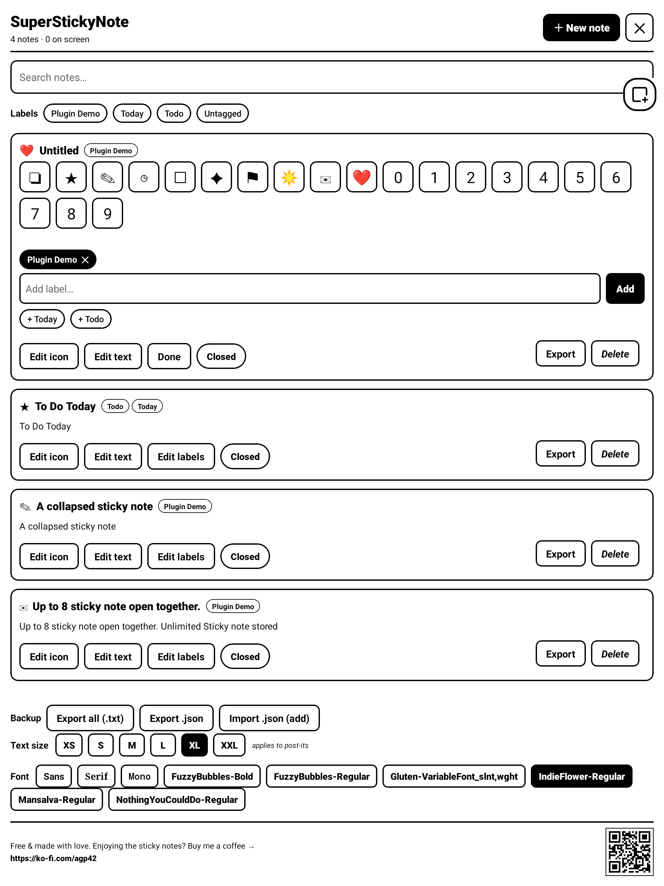

# SuperStickyNote for Supernote — User Guide

Floating sticky quick-notes for your Supernote. A small **✚ bubble** floats over
everything; tap it and a **sticky note** appears on top of your notebook or document.
Write with the keyboard, drag it around, keep several open at once — your thoughts
land on the page without ever leaving what you were doing.

> Works inside the **NOTE** and **DOCUMENT** apps. Notes are plain text (handwriting
> inside a sticky note is not supported yet). Tested on Manta (A5 X2) and A5 X.

---

## 1. Install

1. Copy `superstickynote-<version>.snplg` to the `MyStyle/` folder on the device
   (via USB, or `adb push … /storage/emulated/0/MyStyle/`).
2. On the device: **Settings → Apps → Plugins → Add Plugin** → pick the file.
3. Open a notebook. The **✚ bubble** appears (top-right by default).

*Updating:* uninstall the old version first (Settings → Apps → Plugins), then add the new `.snplg`.

> **After removing the plugin, the ✚ bubble stays on screen** until you **restart the
> device** — the bubble is a system overlay owned by the plugin host, cleared when the
> process is recycled.

---

## 2. The bubble

The **✚ bubble** is always within reach.

- **Tap ✚** → creates a new sticky note and opens the keyboard right away.
- **Drag** the bubble to move it anywhere.

---

## 3. The sticky note

A sticky note floats on top of the page. The rest of the screen stays live — you can keep
writing in your notebook in the gaps between sticky notes.

| Gesture | What it does |
|---|---|
| **Tap the body** | Edit — the keyboard opens and you type inline |
| **✓ (top-right)** | Finish editing — closes the keyboard |
| **Tap the header bar** | Collapse / expand (collapsed shows only the first line as the title) |
| **Tap the icon** | Open the full list (Manager) |
| **Tap the labels** | Open the Manager (when the sticky note has labels) |
| **Drag the header** | Move the sticky note |
| **Drag the ◢ corner** | Resize (bottom-right) |
| **Long-press the body** | Copy / Paste bar |
| **✕ (top-right)** | Close the sticky note (it stays saved in the list) |

- **Saving is automatic** — text is saved as you type; tapping outside the sticky note also closes the keyboard.
- The **first non-empty line** becomes the title (shown when collapsed and in the list).
- **Labels** you add (in the Manager) show as chips in the header, display-only.
- **Long notes** fill the whole card and scroll — drag the ◢ corner to make the card bigger.
- Up to **8 sticky notes on screen at once** (they overlap freely). At 8, adding another shows a reminder instead of removing one. **No limit** on total notes.
- **Move it with a finger, not the pen** — see *Good to know* below.

---

## 4. The full page (Manager)

Open it from the **toolbar button**, or by **tapping a sticky note's icon or labels**.

Your open sticky notes **stay on top of the Manager**, so changing the font or text size
updates them **live**, and opening a note doesn't close the panel.

- **＋ New note** — pick an icon, a fresh sticky note floats on the page.
- **Search** — filter by text; tap the **✕** to clear.
- **Labels filter** — tap labels to filter (a note must match **all** selected labels);
  **Untagged** finds notes with no labels; **Clear** resets. Combines with search.

**Per-note actions** (each row):

- **Edit icon** — pick an icon (symbols and digits 0–9). *Shortcut: tap the row's icon.*
- **Edit text** — a text editor with **Copy**, **Paste** and **Done**. *Shortcut: tap the title or preview.*
- **Edit labels** — add labels (type + **Add**, or tap a suggestion); tap a label chip to remove it. *Shortcut: tap the labels by the title.*
- **On screen / Closed** — one button that shows the state **and** toggles it (solid = floating, outline = closed).
- **Export / Delete** (bottom-right) — save the note as `.txt`, or remove it.

**Text size & Font** (bottom of the Manager):

- **Text size** — XS · S · M · L · XL · XXL, applied to every sticky note.
- **Font** — **Sans / Serif / Mono**, plus any font you've dropped in `MyStyle/fonts`
  (e.g. handwriting fonts). Applies to the sticky note text.

---

## 5. Lasso handwriting into a sticky (OCR)

In a **notebook (NOTE)**, lasso some handwriting, then tap **Add to sticky** in the
lasso toolbar. The selection is recognized (OCR) and dropped into a **new sticky note**.
Recognition takes a few seconds — a "Recognizing…" message shows while it works.

---

## 6. Sticky note → note, and export

- **Into a note:** open a sticky note, **long-press → Copy**, then paste it into a text box
  on your notebook page.
- **Export a note:** the **Export** button on a row saves that note as a `.txt`.
- **Backup / restore all** (bottom of the Manager):
  - **Export all (.txt)** — one text file per note.
  - **Export .json** — a single `SuperStickyNote-notes.json` snapshot of everything.
  - **Import .json (add)** — reads that backup and **adds** any notes you don't already
    have. It **never overwrites** existing notes, so it's safe.

Exports go to `MyStyle/Plugins/SuperStickyNote/` (visible over USB/MTP).

---

## 7. Where your notes live

Your notes live in the plugin's **private, hidden** storage (not in a synced folder),
so cloud sync can't corrupt them. Backups and exports go to the visible
`MyStyle/Plugins/SuperStickyNote/` folder.

---

## 8. Good to know / limits

- **Text only** — handwriting inside a sticky note isn't supported yet.
- **8 sticky notes** can float at once; total notes are unlimited.
- **Lasso → Add to sticky** works in **NOTE** files only; OCR takes a few seconds.
- **Moving a sticky note with the pen also draws on the note underneath** — the Supernote
  pen has a hardware path into the notebook that a plugin overlay can't intercept. Two ways
  around it: drag with your **finger**, or first select the **eraser** or **lasso** tool —
  then you can drag and resize with the pen without leaving a stroke.
- **Custom fonts** from `MyStyle/fonts` render on the **sticky note**; the Manager list shows
  their names (it can't preview arbitrary font files).
- **Uninstalling leaves the ✚ bubble on screen** — **restart the device** to clear it.
- If a sticky note ever gets stuck after a firmware hiccup, force-stopping the plugin host
  (or restarting the device) clears any stray window.

---

## 9. Support

SuperStickyNote is free and made with love by a Supernote user, for Supernote users.
If it earns a spot on your screen, you can buy me a coffee:

**https://ko-fi.com/agp42**
