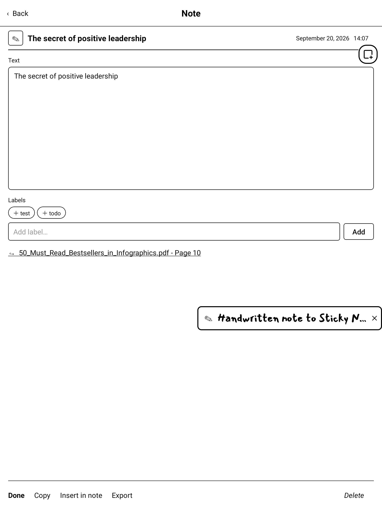
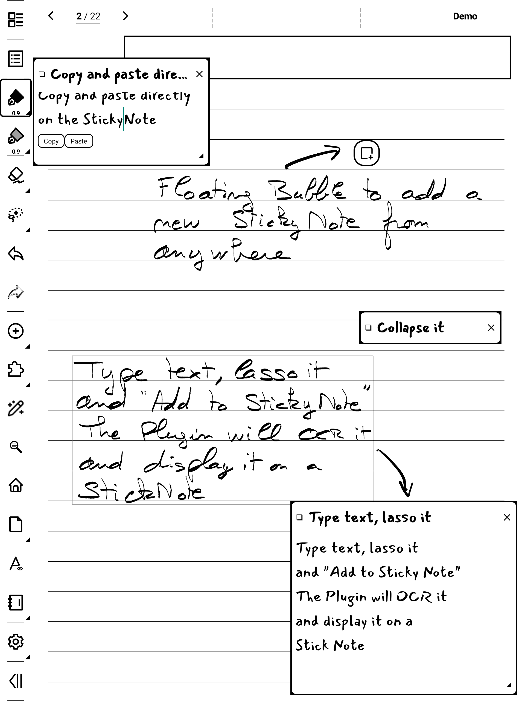

# SuperStickyNote for Supernote — User Guide

Floating sticky quick-notes for your Supernote. A small **launcher bubble** floats over
everything; tap it and a **sticky note** appears on top of your notebook or document.
Write with the keyboard, drag it around, keep several open at once — your thoughts land
on the page without ever leaving what you were doing.

And it works the other way too: lasso your handwriting, or select text in a PDF, and it
becomes a sticky note with a link back to where it came from.

> Works inside the **NOTE** and **DOCUMENT** apps. Sticky notes hold plain text
> (handwriting *inside* a sticky note is not supported yet — but you can capture
> handwriting *from the page*, see §5).
>
> **Firmware:** Supernote's firmware is called *Chauvet* — what matters is the version
> (check it in device settings). This release targets **Chauvet 3.29.43 (Manta/Nomad) /
> 2.26.40 (A5 X / A6 X) or later** and won't run on an earlier Chauvet; devices still on
> an earlier version need the previous release. Verified on Manta/Nomad.

---

## 1. Install

1. Copy `superstickynote-<version>.snplg` to the `MyStyle/` folder on the device
   (via USB, or `adb push … /storage/emulated/0/MyStyle/`).
2. On the device: **Settings → Apps → Plugins → Add Plugin** → pick the file.
3. Open a notebook. The **launcher bubble** appears (top-right by default).

*Updating:* uninstall the old version first (Settings → Apps → Plugins), then add the new `.snplg`.

> **After removing the plugin, the bubble stays on screen** until you **restart the
> device** — the bubble is a system overlay owned by the plugin host, cleared when the
> process is recycled.

---

## 2. The bubble

The **launcher bubble** — a small note with a **+** — is always within reach.

- **Tap it** → creates a new sticky note and opens the keyboard right away.
- **Drag** it to move it anywhere.
- Don't want it on screen? Hide it from **Settings → Launcher bubble** (§6).

---

## 3. The sticky note

A sticky note floats on top of the page. The rest of the screen stays live — you can keep
writing in your notebook in the gaps between sticky notes.

| Gesture | What it does |
|---|---|
| **Tap the body** | Edit — the keyboard opens and you type inline |
| **✓ (top-right)** | Finish editing — closes the keyboard |
| **Tap the header bar** | Collapse / expand (collapsed shows only the first line as the title) |
| **Tap the icon** | Open the full list (Manager) |
| **Tap the labels** | Open the Manager (when the sticky note has labels) |
| **Drag the header** | Move the sticky note |
| **Drag the ◢ corner** | Resize (bottom-right) |
| **Long-press the body** | Copy / Paste bar |
| **✕ (top-right)** | Close the sticky note (it stays saved in the list) |

- **Saving is automatic** — text is saved as you type; tapping outside the sticky note also closes the keyboard.
- The **first non-empty line** becomes the title (shown when collapsed and in the list).
- **Labels** show as chips in the header, display-only.
- **Long notes** fill the whole card and scroll — drag the ◢ corner to make the card bigger.
- **8 sticky notes on screen at once** by default, and you can raise that to **40**
  (§6). At the limit, creating another keeps it in the list instead of dropping one.
  **No limit** on total notes.
- **Move it with a finger, not the pen** — see *Good to know* below.

---

## 4. The Manager

Open it from the **toolbar button**, or by **tapping a sticky note's icon or labels**.
Your open sticky notes **stay on top of the Manager**, so changing the font or text size
updates them **live**, and opening a note doesn't close the panel.

**The left rail** filters the list, with a count beside each entry:

- **All**, **On screen**, **Untagged**, then **one row per label**.
- **＋ New StickyNote** — pick an icon; a fresh sticky note floats on the page.
- **⚙ Settings** — see §6.

**The list** shows one card per note: its icon, the title, the first lines, then the date
and — for a captured note — the file and page it came from. A note that is **on screen**
right now wears its icon in a black square. The list is **paged**: use
**« ‹ 1/3 › »** at the bottom. **Search** sits above the list and filters as you type.

**Tap a card to select it**, and its buttons appear underneath:

| Button | What it does |
|---|---|
| **Show on screen / Hide** | Float this sticky note on the page, or take it off |
| **Edit** | Open the note page (§5) — *shortcut: press and hold the card* |
| **Insert in note** | Drop this note's text onto the notebook page underneath (§7) |
| **Go to source** | Jump back to the page this note was captured from |
| **Delete** | Remove the note |

---

## 5. The note page

- **Text** — edit the whole note. The same note can be open in its floating card at the
  same time; both stay in step.
- **Icon** — tap the icon beside the title to change it (symbols and digits 0–9).
- **Labels** — type one and tap **Add**, or tap a suggestion. Tap a label to remove it.
- **↪ source line** — only on captured notes: jumps back to the notebook or document page
  it came from, opening the file if it isn't already open.
- **Done · Copy · Insert in note · Export · Delete** along the bottom.

---

## 6. Settings

- **Text size** — XS · S · M · L · XL · XXL, applied to every sticky note.
- **Font** — **Sans / Serif / Mono**, plus any font you've dropped in `MyStyle/fonts`.
  Each one is **shown in its own typeface**, so you pick by looking, not by name.
- **Launcher bubble** — **Shown / Hidden**. When it's hidden you still create notes with
  **＋ New StickyNote**, or by capturing from a page.
- **Frame on capture** — **Off / Black / Grey 1 / Grey 2**: when you capture handwriting
  with the lasso, optionally draw a thin box **on the note** around what you captured, so
  you can see at a glance what was turned into a sticky note. A single thin line you can
  erase in one stroke. **Grey 1** is darker, **Grey 2** lighter. Default **Off**.
- **Backup** — see §8.
- **Sticky notes on screen** — how many may float at once: **8** by default, anything
  from **1 to 40**. Above 8 you'll see a warning: every floating note is a system overlay,
  and a screenful of them will slow the device down.

---

## 7. Capturing from a page

### Handwriting → sticky note (OCR)

Lasso some handwriting, then tap **Add to StickyNote** in the lasso toolbar. The selection
is recognised and dropped into a **new sticky note**. Recognition takes a few seconds — a
"Recognizing…" message shows while it works.

This works in a **notebook** *and* on **handwritten annotations in a PDF or EPUB**.

- The **lasso clears itself** once the text is captured. Your handwriting is untouched.
- A **shapes-only** selection still makes a sticky note, describing what it found
  ("2 × Circle").
- Turn on **Frame on capture** (§6) to box what you captured, on a notebook page.

### Underline a word to label the note

Draw a **clean straight underline** (the straight-line shape tool) under a word inside your
lasso selection, and that word becomes a **label** on the new sticky note. Underline three
words, get three labels. No underline, nothing happens — an ordinary capture is unchanged.

### PDF text → sticky note

Select text in a **PDF or EPUB** with the reader's text tool, then tap
**Add to StickyNote** in the selection toolbar that pops up — the circled button below.

No recognition needed — the text is already text, so the sticky note appears instantly.

Every captured note keeps a **Go to source** backlink to its file and page.

---

## 8. Getting text back out

- **Insert in note** — puts the sticky note's text on the **notebook page underneath**, as
  an editable text box, using the **Font** and **Text size** from Settings. The Manager
  closes so you land on the result. *(Notebooks only: a PDF page has no text boxes.)*
- **Copy** — on the note page, copies the text to the clipboard.
- **Export** — saves that note as a `.txt`.
- **Backup / restore all** (Settings → Backup):
  - **Export all (.txt)** — one text file per note.
  - **Export .json** — a single `SuperStickyNote-notes.json` snapshot of everything.
  - **Import .json** — reads that backup and **adds** any notes you don't already have.
    It **never overwrites** existing notes, so it's safe.

Exports go to `MyStyle/Plugins/SuperStickyNote/` (visible over USB/MTP).

---

## 9. Where your notes live

Your notes live in the plugin's **private, hidden** storage (not in a synced folder), so
cloud sync can't corrupt them. Backups and exports go to the visible
`MyStyle/Plugins/SuperStickyNote/` folder.

---

## 10. Good to know / limits

- **Text only inside a sticky note** — handwriting *in* a card isn't supported yet. You can
  capture handwriting *from the page* (§7).
- **Moving a sticky note with the pen also draws on the note underneath** — the Supernote
  pen has a hardware path into the notebook that a plugin overlay can't intercept. Two ways
  around it: drag with your **finger**, or first select the **eraser** or **lasso** tool —
  then you can drag and resize with the pen without leaving a stroke.
- **Insert in note is notebook-only.** A PDF page can't hold a text box. Capturing *from*
  a PDF works fine, and so does the capture frame — that one is a drawn shape, which a
  document accepts.
- **Pasting from other apps is limited by Android.** Since Android 10 an app may only read
  the clipboard while it holds the screen's focus, which a plugin doesn't — so text copied
  in another app can't be pulled into a sticky note. Copying *out* works.
- **Above 8 floating notes**, expect the device to get slower: each one is a system window.
- **If the bubble survives an uninstall**, restart the device. The plugin now clears its
  own overlays when it is torn down — reinstalling no longer leaves anything behind — but
  the bubble is a system window owned by the plugin host, so a teardown that never reaches
  us can still strand it.
- If a sticky note ever gets stuck after a firmware hiccup, force-stopping the plugin host
  (or restarting the device) clears any stray window.

---

## 11. Support

SuperStickyNote is free and made with love by a Supernote user, for Supernote users.
If it earns a spot on your screen, you can buy me a coffee:

**https://ko-fi.com/agp42**
